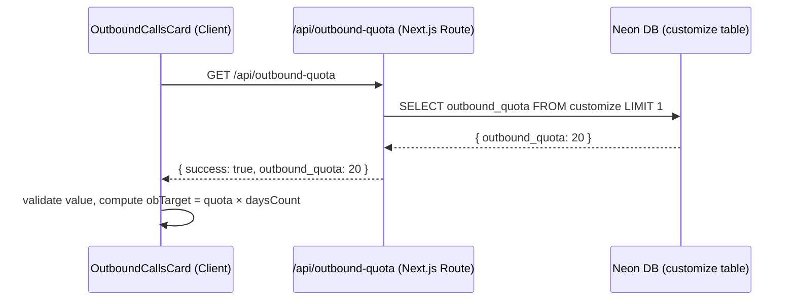

# Design Document

## Outbound Quota API

---

## Overview

This feature replaces the hardcoded outbound call target (`20`) in `OutboundCallsCard` with a value fetched dynamically from the `customize` table in the Neon database. A new Next.js API route (`GET /api/outbound-quota`) reads the `outbound_quota` column and returns it as JSON. The component fetches this value on mount, validates it, and uses it to compute `OB_Target = outbound_quota × daysCount`.

The change is purely additive on the API side and minimally invasive on the component side — no new props are required, and the component falls back to `20` if the fetch fails or returns an invalid value.

---

## Architecture



**Data flow summary:**
1. Component mounts → triggers `useEffect` fetch to `/api/outbound-quota`
2. API route queries the `customize` table via `@neondatabase/serverless`
3. API returns `{ success: true, outbound_quota: <number> }` on success
4. Component validates the value (finite positive number) and stores it in state
5. `obTarget` is derived as `outboundQuota × daysCount` (replacing the hardcoded `20`)

---

## Components and Interfaces

### API Route: `app/api/outbound-quota/route.ts`

**Method:** `GET`  
**Path:** `/api/outbound-quota`  
**No query parameters required.**

**Success response (200):**
```json
{ "success": true, "outbound_quota": 20 }
```

**Not found response (404):**
```json
{ "success": false, "error": "outbound_quota not found" }
```

**Server error response (500):**
```json
{ "success": false, "error": "Failed to fetch outbound quota" }
```

The route follows the same pattern used by all other routes in this project:
- Import `neon` from `@neondatabase/serverless`
- Read `TASKFLOW_DB_URL` from `process.env` at module load time; throw if missing
- Create the `sql` tagged-template client at module scope
- Export `GET` as an async function
- Export `dynamic = "force-dynamic"` to opt out of static caching

### Component: `components/roles/tsa/dashboard/list/outbound.tsx`

**Changes:**
- Add `outboundQuota` state (number, default `20`) and `quotaLoading` state (boolean, default `true`)
- Add `useEffect` on mount to fetch `/api/outbound-quota`
- Validate the fetched value with `isFinitePositive(value)` before storing; fall back to `20` with a `console.warn` if invalid
- Replace `const obTarget = 20 * daysCount` with `const obTarget = outboundQuota * daysCount`
- Render a loading placeholder (`"…"`) in the OB Target cell while `quotaLoading` is `true`
- No new props added; existing `OutboundCardProps` interface is unchanged

**Validation helper (inline):**
```ts
const isFinitePositive = (v: unknown): v is number =>
  typeof v === "number" && Number.isFinite(v) && v > 0;
```

---

## Data Models

### `customize` table (existing)

| Column | Type | Notes |
|---|---|---|
| `outbound_quota` | `integer` / `numeric` | The daily outbound call target per TSA |

The query used by the API route:
```sql
SELECT outbound_quota FROM customize LIMIT 1;
```

The `LIMIT 1` is intentional — the `customize` table is a single-row configuration table. If the result set is empty, the route returns 404.

### API Response Type (TypeScript)

```ts
type OutboundQuotaResponse =
  | { success: true; outbound_quota: number }
  | { success: false; error: string };
```

---

## Correctness Properties

*A property is a characteristic or behavior that should hold true across all valid executions of a system — essentially, a formal statement about what the system should do. Properties serve as the bridge between human-readable specifications and machine-verifiable correctness guarantees.*

### Property 1: API response round-trip preserves the quota value

*For any* finite positive integer stored as `outbound_quota` in the `customize` table, calling `GET /api/outbound-quota` with a mock DB returning that value SHALL produce a JSON response where `success` is `true`, `outbound_quota` is a `number` (not a string), and its value equals the stored value.

**Validates: Requirements 1.2, 1.3, 3.3**

### Property 2: OB Target computation is correct for all valid inputs

*For any* finite positive number `outbound_quota` and any positive integer `daysCount`, the computed `OB_Target` SHALL equal `outbound_quota × daysCount`.

**Validates: Requirements 2.2**

### Property 3: Validation rejects all non-finite-positive values

*For any* value that is not a finite positive number (including `null`, `undefined`, strings, `NaN`, `Infinity`, `0`, and negative numbers), the `isFinitePositive` validation function SHALL return `false`, causing the component to fall back to `20`.

**Validates: Requirements 3.1, 3.2**

---

## Error Handling

| Scenario | API Behavior | Component Behavior |
|---|---|---|
| Successful query | 200 + `{ success: true, outbound_quota: N }` | Use `N` for `obTarget` |
| Row not found in `customize` | 404 + `{ success: false, error: "outbound_quota not found" }` | Fall back to `20`, log warning |
| Database error | 500 + `{ success: false, error: "Failed to fetch outbound quota" }` | Fall back to `20`, log warning |
| Network / fetch error | — (fetch throws) | Fall back to `20`, log warning |
| Invalid value type (non-number) | — (API always returns number) | Fall back to `20`, log warning |
| `TASKFLOW_DB_URL` not set | Module throws at startup (prevents route loading) | — |

The component never crashes regardless of API outcome. The fallback value of `20` preserves the previous hardcoded behavior.

---

## Testing Strategy

### Unit Tests

Focus on specific examples and edge cases:

- **API route — success path:** Mock DB returns `{ outbound_quota: 25 }`, verify response is `{ success: true, outbound_quota: 25 }` with status 200.
- **API route — not found:** Mock DB returns empty array, verify 404 and error body.
- **API route — DB error:** Mock DB throws, verify 500 and error body.
- **Component — loading state:** While fetch is pending, OB Target cell shows `"…"`.
- **Component — fetch failure fallback:** Mock fetch rejects, verify `outboundQuota` defaults to `20`.
- **Component — invalid value fallback:** Mock fetch resolves with `outbound_quota: -5`, verify fallback to `20`.

### Property-Based Tests

Uses a property-based testing library (e.g., [fast-check](https://github.com/dubzzz/fast-check) for TypeScript).  
Each property test runs a minimum of **100 iterations**.

**Property 1 — API response round-trip:**
- Generator: `fc.integer({ min: 1, max: 10000 })` for `outbound_quota`
- Assert: response `outbound_quota === generated value`, `typeof outbound_quota === 'number'`, `success === true`
- Tag: `Feature: outbound-quota-api, Property 1: API response round-trip preserves the quota value`

**Property 2 — OB Target computation:**
- Generator: `fc.integer({ min: 1, max: 1000 })` for `outbound_quota`, `fc.integer({ min: 1, max: 365 })` for `daysCount`
- Assert: `obTarget === outbound_quota * daysCount`
- Tag: `Feature: outbound-quota-api, Property 2: OB Target computation is correct for all valid inputs`

**Property 3 — Validation rejects invalid values:**
- Generator: `fc.oneof(fc.constant(null), fc.constant(undefined), fc.string(), fc.constant(NaN), fc.constant(Infinity), fc.constant(-Infinity), fc.integer({ max: 0 }), fc.constant(0))`
- Assert: `isFinitePositive(value) === false`
- Tag: `Feature: outbound-quota-api, Property 3: Validation rejects all non-finite-positive values`

### Integration Tests

Not required for this feature — the API route is a thin wrapper over a single SQL query with no complex business logic. The unit tests with mocked DB cover all meaningful code paths.
